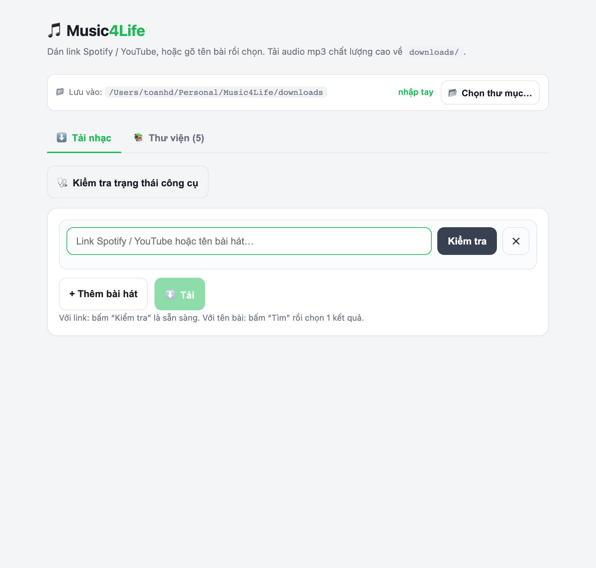
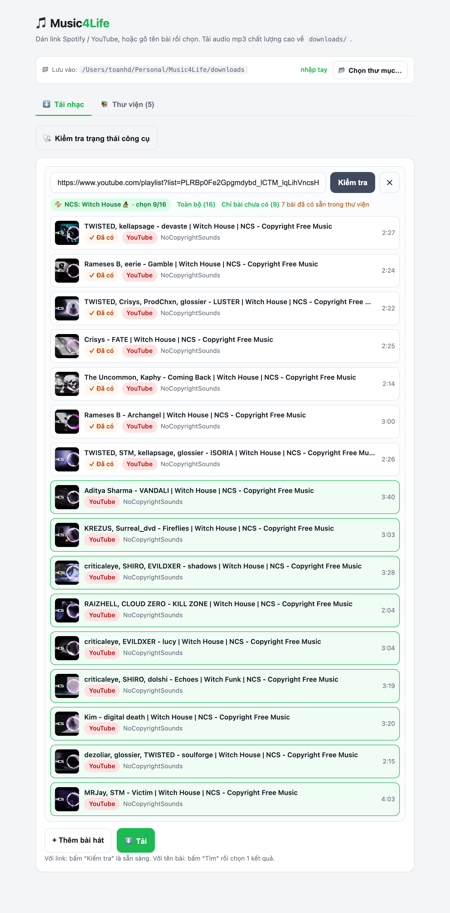
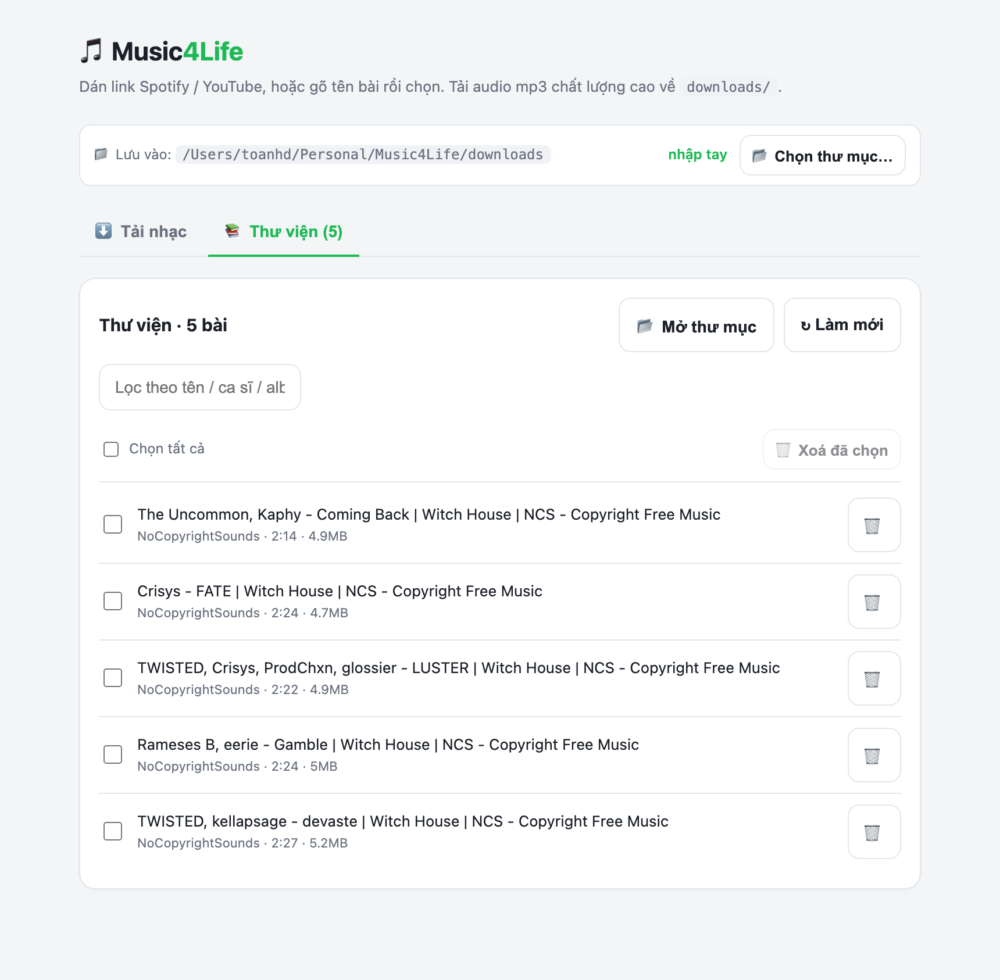

# 🎵 Music4Life

Web app **cục bộ** giúp tải nhạc (audio `.mp3` chất lượng cao) từ **Spotify** và **YouTube** bằng giao diện bấm-chọn, thay cho việc gõ lệnh terminal. Bên trong là hai công cụ mạnh: [spotDL](https://github.com/spotDL/spotify-downloader) (cho Spotify) và [yt-dlp](https://github.com/yt-dlp/yt-dlp) (cho YouTube), được bọc lại bằng một backend [FastAPI](https://fastapi.tiangolo.com/) gọn nhẹ + một trang HTML/JS thuần (không cần build, không framework nặng).

> Chạy trên máy bạn, mở bằng trình duyệt ở `http://127.0.0.1:8000`. Nhạc tải về một thư mục bạn tự chọn.

---

## ✨ Tính năng

- **3 kiểu nhập**: dán link **Spotify**, link **YouTube**, hoặc gõ **tên bài** rồi chọn từ kết quả tìm kiếm (gộp cả Spotify lẫn YouTube).
- **Tách album / playlist** (cả Spotify lẫn YouTube) thành **từng bài**, cho **chọn nhiều** — với lựa chọn nhanh *"Toàn bộ"* hoặc *"Chỉ bài chưa có"*.
- **Chống tải trùng**: quét thư viện trước, so khớp mờ (fuzzy) theo **tựa bài**, đánh dấu **"✓ Đã có"** và **bỏ chọn sẵn** những bài đã có.
- **Xem trước thông tin** bài hát ngay khi dán link (tựa, ca sĩ, thời lượng, ảnh bìa). Riêng Spotify lấy qua Open Graph nên **không cần API key** và **không bị giới hạn**.
- **Thanh tiến độ** theo trạng thái từng bài: *Đang chờ → Đang tải → Đang chuyển mp3 → Xong / Lỗi*.
- **Trình quản lý thư viện** (tab riêng): xem, lọc, **chọn nhiều & xoá hàng loạt**, mở thư mục trong Finder.
- **Đổi thư mục lưu** bằng hộp chọn thư mục **native của macOS** (áp dụng cho cả tải lẫn thư viện, nhớ qua các lần chạy).
- **Kiểm tra trạng thái công cụ** (ffmpeg / yt-dlp / spotDL / Spotify) ngay trong giao diện.
- Chất lượng cao mặc định: **mp3 320kbps** (Spotify), audio tốt nhất + ảnh bìa + metadata (YouTube).

## 📸 Ảnh chụp

| Tải nhạc | Tách playlist + chống trùng | Thư viện |
|---|---|---|
|  |  |  |

> Ảnh minh hoạ dùng nhạc **không bản quyền** từ [NoCopyrightSounds (NCS)](https://ncs.io/) — chỉ để demo tính năng.

---

## ⚙️ Yêu cầu (prerequisites)

- **macOS** — hiện dùng một số tính năng riêng của macOS (hộp chọn thư mục `osascript`, mở Finder bằng `open`). Trên Linux/Windows sẽ cần chỉnh các chỗ đó.
- **Python 3.10+** (mã dùng cú pháp kiểu `str | None`).
- **git** — để tải mã nguồn (macOS có sẵn qua Xcode Command Line Tools, hoặc `brew install git`).
- **[Homebrew](https://brew.sh/)** để cài 2 phụ thuộc hệ thống:
  - **ffmpeg** — bắt buộc (chuyển/ghép sang mp3, gắn ảnh bìa).
  - **deno** — để yt-dlp giải mã thử thách JS của YouTube (lấy được định dạng chất lượng cao nhất).

Kiểm tra nhanh đã có đủ chưa:

```bash
python3 --version   # >= 3.10
git --version
brew --version
```

## 🚀 Cài đặt

```bash
# 1) Phụ thuộc hệ thống
brew install ffmpeg deno

# 2) Lấy mã nguồn
git clone <URL-repo-cua-ban> Music4Life
cd Music4Life

# 3) Tạo virtual env + cài thư viện Python
python3 -m venv .venv
.venv/bin/pip install --upgrade pip
.venv/bin/pip install -r requirements.txt

# 4) Chạy
./run.sh
```

`./run.sh` khởi động server ở chế độ **nền** và tự mở trình duyệt tới `http://127.0.0.1:8000`.

> 💡 Lần chạy **đầu tiên** có thể hơi lâu vài giây (Python biên dịch `.pyc` cho cả cây thư viện) — các lần sau gần như tức thì.

## ▶️ Sử dụng

### Lệnh chạy
```bash
./run.sh          # khởi động (nền) + mở trình duyệt
./run.sh stop     # dừng server
./run.sh log      # xem log realtime (Ctrl+C để thoát xem log, server vẫn chạy)
```

### Tab "Tải nhạc"
1. Dán **link** (Spotify/YouTube) rồi bấm **Kiểm tra** → hiện thẻ thông tin bài hát.
   Hoặc gõ **tên bài** rồi bấm **Tìm** → chọn 1 kết quả.
2. Với **album/playlist**: app tách ra từng bài; chọn *"Toàn bộ"* hay *"Chỉ bài chưa có"*, hoặc bấm từng thẻ để bật/tắt.
3. Bấm **➕ Thêm bài hát** để tải nhiều mục cùng lúc.
4. Bấm **⬇️ Tải tất cả** (chỉ sáng khi có bài được chọn). Theo dõi tiến độ ở khung bên dưới.

### Tab "Thư viện"
- Xem toàn bộ nhạc trong thư mục lưu, **lọc** theo tên/ca sĩ/album.
- Tick từng dòng (bấm cả dòng cũng được) → **🗑 Xoá đã chọn**, hoặc xoá từng bài.
- **📂 Mở thư mục** để mở Finder.

### Đổi thư mục lưu
Bấm **📂 Chọn thư mục…** ở thanh trên cùng → chọn thư mục bằng hộp thoại của macOS. Lựa chọn này áp dụng cho **cả tải lẫn thư viện** và được nhớ lại (lưu ở `.music4life.json`).

## 🔧 Cấu hình

- **Chất lượng / metadata của spotDL** nằm ở `~/.spotdl/config.json` (mặc định đã đặt `bitrate: 320k`). spotDL tự tạo file này lần chạy đầu.
- **Spotify API key (tuỳ chọn):** mặc định spotDL dùng key dùng chung nên **tìm kiếm theo tên trên Spotify hay bị giới hạn (rate-limit)**. Khi đó app tự chuyển sang dùng kết quả **YouTube**, còn **tải từ link** và **xem trước Spotify** vẫn hoạt động bình thường. Muốn tìm kiếm Spotify ổn định, tạo app tại [Spotify Developer Dashboard](https://developer.spotify.com/dashboard) rồi điền `client_id`/`client_secret` của bạn vào `~/.spotdl/config.json`.

## 🧠 Hoạt động thế nào (tóm tắt)

- Backend phân loại đầu vào (link Spotify / link YouTube / tên bài) rồi định tuyến: Spotify → spotDL, YouTube → yt-dlp.
- **Tải** chạy `spotdl` / `yt-dlp` dưới dạng tiến trình con, **tuần tự từng bài**; giao diện hỏi trạng thái qua *polling*.
- **Xem trước Spotify** đọc thẻ Open Graph của trang Spotify công khai (không cần API).
- **Tách album/playlist**: Spotify đọc các thẻ `music:song`; YouTube dùng `yt-dlp --flat-playlist`.
- **Chống trùng** đọc ID3 (mutagen) của các file `.mp3` trong thư mục lưu rồi so khớp mờ (rapidfuzz) theo tựa.

## ❓ Khắc phục sự cố

| Hiện tượng | Nguyên nhân & cách xử lý |
|---|---|
| Tìm Spotify báo "bị giới hạn" 🟡 | Key dùng chung của spotDL bị rate-limit (có thể tới 24h). Dùng kết quả YouTube, hoặc thêm Spotify API key riêng (xem mục Cấu hình). |
| Playlist YouTube không tách được | Có thể playlist để **riêng tư (private)**. Đổi sang **Public/Unlisted** rồi thử lại. |
| Giao diện không cập nhật sau khi sửa | Trình duyệt cache — **hard-refresh** (Cmd+Shift+R). |
| Server tự tắt khi chạy trong IDE | Một số IDE tự chèn lệnh `source .venv/bin/activate` vào terminal làm ngắt tiến trình. `run.sh` đã chạy nền để tránh; hoặc chạy trong Terminal.app thường. |
| `address already in use` (port 8000) | `./run.sh stop` rồi chạy lại. |
| yt-dlp tải thiếu định dạng tốt | Cài `deno` (`brew install deno`) để giải JS challenge của YouTube. |

## ⚠️ Miễn trừ trách nhiệm & Bản quyền

> **Đây là công cụ kỹ thuật phục vụ mục đích cá nhân, học tập và sử dụng nội dung hợp pháp.** Nó không lưu trữ hay phân phối nội dung nào — chỉ tự động hoá việc tải về.

- **Tôn trọng quyền sở hữu trí tuệ.** Phần lớn nhạc trên Spotify/YouTube được **bảo hộ bản quyền**. Việc tải xuống có thể **vi phạm bản quyền và/hoặc điều khoản dịch vụ** của các nền tảng đó.
- **Chỉ tải nội dung bạn được phép**: nhạc không bản quyền (vd [NCS](https://ncs.io/)), nội dung Creative Commons/public domain, tác phẩm của chính bạn, hoặc khi đã có sự cho phép của chủ sở hữu.
- **Không** dùng để tải/sao chép/phân phối nội dung có bản quyền trái phép, không dùng cho mục đích thương mại với nội dung của người khác.
- **Bạn hoàn toàn tự chịu trách nhiệm** về cách sử dụng. Tác giả và các thư viện liên quan (spotDL, yt-dlp) **không chịu trách nhiệm** cho việc dùng sai mục đích. Phần mềm cung cấp "nguyên trạng" (xem [LICENSE](LICENSE)).

## 🔒 Bảo mật

- App **chỉ chạy cục bộ** (lắng nghe `127.0.0.1`, không có đăng nhập). **Đừng** mở/expose cổng này ra Internet.

## 📄 Giấy phép

[MIT](LICENSE) © ToanHD — tự do dùng, sửa, chia sẻ.
